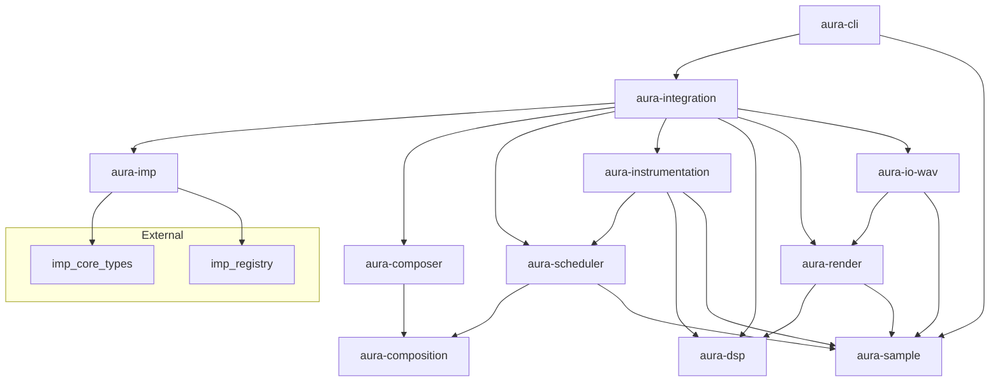

# Aura

Procedural music composition and synthesis software.

## Status

Early / pre-alpha. Multi-crate workspace with Imp graph-driven offline WAV rendering.

## Language

Rust (primary).

## Development environment

This project uses a [Dev Container](.devcontainer/devcontainer.json) built from a custom Dockerfile. Sibling imp repos are bind-mounted under `.mnt/` at container start (expected host layout: `~/dev/aura`, `~/dev/imp-rust`, `~/dev/imp-spec`, `~/dev/imp-ts`). Cargo path deps resolve `imp-rust` from `.mnt/imp-rust`.

Open the repository in a Dev Container to get rust-analyzer, Clippy, and LLDB preconfigured.

## Quick start

```bash
cargo build
cargo test
cargo clippy
./demos/render-all.sh
```

This renders `demos/sine.json` and `demos/arpeggio.json` to `output/sine.wav` and `output/arpeggio.wav` (32-bit float, mono, 44100 Hz). The `output/` directory is gitignored.

### CLI

```bash
cargo run -p aura-cli -- \
  --graph demos/sine.json \
  --output output/sine.wav \
  --duration 10s \
  --sample-rate 44100
```

```
aura --graph PATH --output PATH [OPTIONS]

  -g, --graph PATH         Imp graph JSON file
  -o, --output PATH        Output WAV path
  -d, --duration SPEC      Seconds (10, 10s) or measures (2m)
  --tempo BPM              Tempo for measure durations (default: 120)
  -r, --sample-rate HZ     Sample rate (default: 44100)
  -h, --help               Show help
```

## Workspace crates

| Crate | Purpose |
|-------|---------|
| `aura-sample` | DASP sample primitives and timing types |
| `aura-composition` | Notation types and musical time |
| `aura-composer` | Procedural composition generators |
| `aura-scheduler` | Offline event scheduling |
| `aura-instrumentation` | Per-note instruments and mix-down |
| `aura-imp` | Imp node libraries and JSON helpers |
| `aura-dsp` | Pure Time → Sample DSP functions |
| `aura-render` | Offline sampling via `Sampler` |
| `aura-io-wav` | WAV file I/O |
| `aura-io-cpal` | CPAL playback stub (deferred) |
| `aura-integration` | Imp graph translation and render glue |
| `aura-cli` | Thin graph-driven CLI |

## Dependency graph



## Documentation

- [`docs/`](docs/) — requirements, design, and decision records
- [`AGENTS.md`](AGENTS.md) — agent workflow and conventions

## License

MIT — see [LICENSE](LICENSE). Copyright (c) 2026 Silent Orb.
