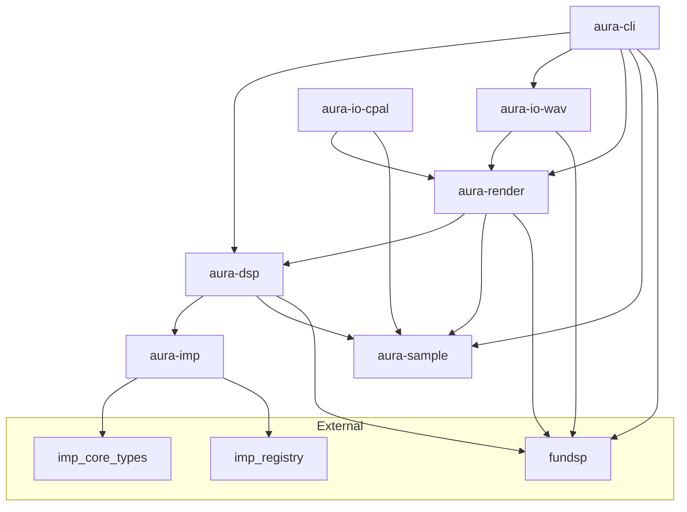

# Aura

Procedural music composition and synthesis software.

## Status

Early / pre-alpha. Multi-crate workspace with offline WAV rendering.

## Language

Rust (primary).

## Development environment

This project uses a [Dev Container](.devcontainer/devcontainer.json) built from a custom Dockerfile. The image bakes in sibling `imp-rust` at `/opt/imp-rust` (build context is the parent of `aura/`; expected layout: `~/dev/aura` + `~/dev/imp-rust`). Rebuild the container after imp-rust changes.

Open the repository in a Dev Container to get rust-analyzer, Clippy, and LLDB preconfigured.

## Quick start

```bash
cargo build
cargo test
cargo clippy
cargo run -p aura-cli
```

The last command generates a 10-second 440 Hz sine wave at `output/sine.wav` (32-bit float, mono, 44100 Hz). The `output/` directory is gitignored.

### CLI options

```
aura [OPTIONS]

  -f, --frequency <HZ>      Sine frequency (default: 440)
  -d, --duration <SECS>     Duration in seconds (default: 10)
  -r, --sample-rate <HZ>    Sample rate (default: 44100)
  -o, --output <PATH>       Output path (default: output/sine.wav)
```

## Workspace crates

| Crate | Purpose |
|-------|---------|
| `aura-sample` | DASP sample primitives and timing types |
| `aura-imp` | Imp graph integration and Aura DSP node libraries |
| `aura-dsp` | FunDSP synthesis graph builders; Imp → FunDSP compiler |
| `aura-render` | Offline audio rendering |
| `aura-io-wav` | WAV file I/O |
| `aura-io-cpal` | CPAL playback stub (deferred) |
| `aura-cli` | Command-line interface |

## Dependency graph



## Documentation

- [`docs/`](docs/) — requirements, design, and decision records
- [`AGENTS.md`](AGENTS.md) — agent workflow and conventions

## License

MIT — see [LICENSE](LICENSE). Copyright (c) 2026 Silent Orb.
