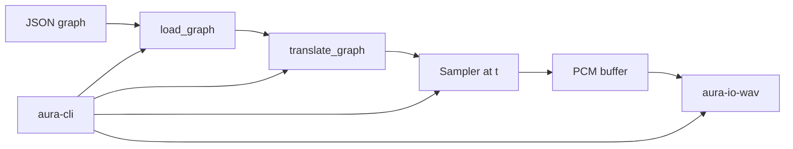

# Architecture

High-level system overview for Aura.

Aura is a **library-first framework**. Surface programs load Imp graphs and render audio via [`aura-integration`](../../crates/aura-integration). See [`notation-synthesis.md`](notation-synthesis.md) and [`imp-execution.md`](imp-execution.md).

## High-level components

| Component | Role |
|-----------|------|
| Composition | Notation types (`aura-composition`) and procedural generators (`aura-composer`) |
| Scheduler | Offline timeline and event dispatch (`aura-scheduler`); live CPAL dispatch deferred |
| Synthesizer | Imp node libraries (`aura-imp`) and pure DSP (`aura-dsp`) |
| Integration | Graph translation and sampling (`aura-integration`) |
| Instrumentation | Per-note sampling and mix-down (`aura-instrumentation`) |
| I/O | Offline WAV export (`aura-io-wav`); CPAL playback stub (`aura-io-cpal`, deferred) |

## Crate layout

| Crate | Role | Key dependencies |
|-------|------|------------------|
| [`aura-sample`](../../crates/aura-sample) | Sample primitives, sample rate, timing math | DASP |
| [`aura-composition`](../../crates/aura-composition) | Notation types, musical time | thiserror |
| [`aura-composer`](../../crates/aura-composer) | Procedural generators | aura-composition |
| [`aura-scheduler`](../../crates/aura-scheduler) | Offline schedule, lookahead context | aura-composition, aura-sample |
| [`aura-instrumentation`](../../crates/aura-instrumentation) | Instruments, per-note render, mix-down | aura-scheduler, aura-dsp, aura-sample |
| [`aura-imp`](../../crates/aura-imp) | Imp node libraries and JSON helpers | imp_core_types, imp_registry |
| [`aura-dsp`](../../crates/aura-dsp) | Pure Time → Sample DSP functions | — |
| [`aura-render`](../../crates/aura-render) | Offline sampling via `Sampler` | aura-dsp, aura-sample |
| [`aura-io-wav`](../../crates/aura-io-wav) | 32-bit float WAV write/read verification | aura-render, aura-sample |
| [`aura-io-cpal`](../../crates/aura-io-cpal) | Real-time playback stub (CPAL bridge) | CPAL, DASP, aura-render |
| [`aura-integration`](../../crates/aura-integration) | Imp graph translation and render glue | aura-imp, composition stack, render, io-wav |
| [`aura-cli`](../../crates/aura-cli) | Thin graph-driven CLI | aura-integration |

Dependency direction flows inward: surface programs → integration → I/O → render → domain crates → sample / dsp → imp.

### Surface integration

An indirect dependency is a hidden direct dependency. Orchestration lives in `aura-integration` and thin surface programs (`aura-cli`, demo scripts), not inside core libraries.

## Data flow

### Imp graph → offline WAV

### Notation in Imp graphs

Music nodes (`arpeggio`, `epic_minor_progression`, `note_at_time`, …) delegate to composition crates at **translate time**. Sample-time evaluation uses precomputed schedule tables — timing remains explicit via the `time` signal. Chord progressions are **data signals** (`chord_progression` port type) composed at translate time and sampleable per frame via `ChordSignal`.

### Real-time playback (deferred)

Future CPAL output will call the same `Sampler::at(t)` functions (or block variants) as offline rendering.

## Considerations

- **Real-time audio** — deferred in WSL/devcontainer
- **Determinism** — pure `f(t)` sampling; see [`notation-synthesis.md`](notation-synthesis.md)
- **Modularity** — composition, scheduling, instrumentation, and synthesis are separable via crate boundaries

## Open questions

- Buffer/block sampling optimizations without breaking FP semantics
- Graph-owned duration vs external render parameters
- Live scheduler parity with offline lookahead
