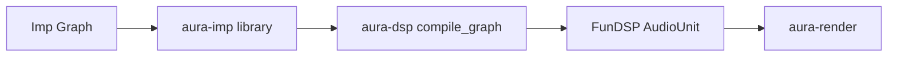
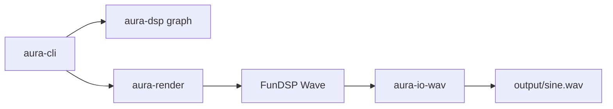

# Architecture

High-level system overview for Aura.

## High-level components

| Component | Role |
|-----------|------|
| Composer | TBD — procedural generation and structuring of musical material |
| Synthesizer | Imp graph libraries (`aura-imp`) and FunDSP lowering (`aura-dsp`) |
| Scheduler | TBD — temporal organization and event dispatch |
| I/O | Offline WAV export (`aura-io-wav`); CPAL playback stub (`aura-io-cpal`, deferred) |

## Crate layout

| Crate | Role | Key dependencies |
|-------|------|------------------|
| [`aura-sample`](../../crates/aura-sample) | Sample primitives, sample rate, timing math | DASP |
| [`aura-imp`](../../crates/aura-imp) | Imp graph integration, Aura DSP node libraries | imp_core_types, imp_registry |
| [`aura-dsp`](../../crates/aura-dsp) | FunDSP graph builders; Imp → FunDSP compiler | FunDSP, aura-imp, aura-sample |
| [`aura-render`](../../crates/aura-render) | Offline rendering via `RenderSpec` | FunDSP, aura-dsp, aura-sample |
| [`aura-io-wav`](../../crates/aura-io-wav) | 32-bit float WAV write/read verification | FunDSP, aura-render |
| [`aura-io-cpal`](../../crates/aura-io-cpal) | Real-time playback stub (CPAL bridge) | CPAL, DASP, aura-render |
| [`aura-cli`](../../crates/aura-cli) | Command-line tools | All of the above |

Dependency direction flows inward: applications → I/O → render → dsp → imp → (imp-rust) / sample.

## Data flow

### Imp graph → offline render

### Offline rendering (current)

### Real-time playback (deferred)

Both paths share the same FunDSP `AudioUnit` graph and `RenderSpec` parameters. Offline uses `Wave::render`; real-time will use block `AudioUnit::process` into CPAL callback buffers with DASP sample conversion.

## Considerations

- **Real-time audio** — low-latency output may constrain architecture; deferred in WSL/devcontainer
- **Determinism** — procedural composition may require reproducible results from a given seed
- **Modularity** — composition, synthesis, and sequencing are separable; enforced via crate boundaries
- **Performance** — synthesis and rendering are likely CPU-intensive

## Open questions

- Composition and scheduling crate boundaries
- Whether to add `hound` for finer-grained WAV/CPAL interop
