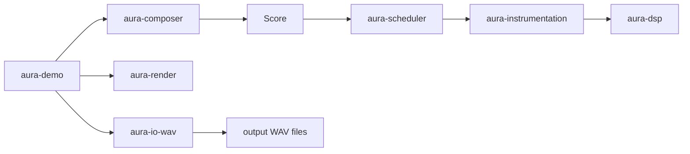
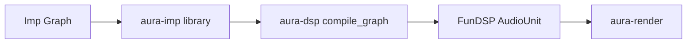

# Architecture

High-level system overview for Aura.

Aura is a **library-first framework**. Specialized programs (e.g. [`aura-demo`](../../crates/aura-demo)) compose domain crates at the surface. See [`notation-synthesis.md`](notation-synthesis.md) for notation→audio integration rules.

## High-level components

| Component | Role |
|-----------|------|
| Composition | Notation types (`aura-composition`) and procedural generators (`aura-composer`) |
| Scheduler | Offline timeline and event dispatch (`aura-scheduler`); live CPAL dispatch deferred |
| Synthesizer | Imp graph libraries (`aura-imp`) and FunDSP lowering (`aura-dsp`) |
| Instrumentation | Per-note sampling and mix-down (`aura-instrumentation`) |
| I/O | Offline WAV export (`aura-io-wav`); CPAL playback stub (`aura-io-cpal`, deferred) |

## Crate layout

| Crate | Role | Key dependencies |
|-------|------|------------------|
| [`aura-sample`](../../crates/aura-sample) | Sample primitives, sample rate, timing math | DASP |
| [`aura-composition`](../../crates/aura-composition) | Notation types, musical time | thiserror |
| [`aura-composer`](../../crates/aura-composer) | Procedural generators | aura-composition |
| [`aura-scheduler`](../../crates/aura-scheduler) | Offline schedule, lookahead context | aura-composition, aura-sample |
| [`aura-instrumentation`](../../crates/aura-instrumentation) | Instruments, per-note render, mix-down | aura-scheduler, aura-dsp, aura-sample |
| [`aura-imp`](../../crates/aura-imp) | Imp graph integration, Aura DSP node libraries | imp_core_types, imp_registry |
| [`aura-dsp`](../../crates/aura-dsp) | FunDSP graph builders; Imp → FunDSP compiler | FunDSP, aura-imp, aura-sample |
| [`aura-render`](../../crates/aura-render) | Offline rendering via `RenderSpec` | FunDSP, aura-dsp, aura-sample |
| [`aura-io-wav`](../../crates/aura-io-wav) | 32-bit float WAV write/read verification | FunDSP, aura-render |
| [`aura-io-cpal`](../../crates/aura-io-cpal) | Real-time playback stub (CPAL bridge) | CPAL, DASP, aura-render |
| [`aura-demo`](../../crates/aura-demo) | Surface integration reference program | composition stack, render, io-wav |
| [`aura-cli`](../../crates/aura-cli) | Legacy sine scaffold (deferred) | aura-dsp, aura-render, aura-io-wav |

Dependency direction flows inward: surface programs → I/O → render → instrumentation → scheduler → composition → sample / dsp → imp.

### Surface integration

An indirect dependency is a hidden direct dependency. Orchestration lives in surface crates (`aura-demo`, future specialized programs), not inside core libraries.

## Data flow

### Notation → offline WAV (v1)

### Imp graph → offline render

### Real-time playback (deferred)

Both offline paths may share FunDSP `AudioUnit` graphs where applicable. Whole-graph render uses `Wave::render`; per-note v1 sampling mixes buffers directly. Real-time will use block `AudioUnit::process` into CPAL callback buffers.

## Considerations

- **Real-time audio** — low-latency output may constrain architecture; deferred in WSL/devcontainer
- **Determinism** — offline rendering must be reproducible from a given seed; see [`notation-synthesis.md`](notation-synthesis.md)
- **Modularity** — composition, scheduling, instrumentation, and synthesis are separable via crate boundaries
- **Performance** — synthesis and rendering are likely CPU-intensive

## Open questions

- Imp graph per voice for complex instruments
- Whether to add `hound` for finer-grained WAV/CPAL interop
- Live scheduler parity with offline lookahead
