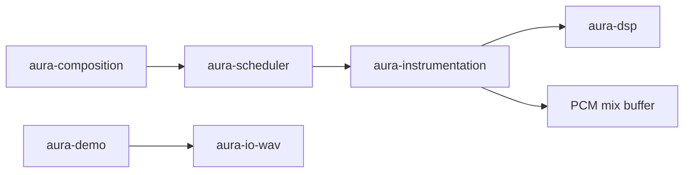

# Notation and synthesis

How musical notation becomes audio in Aura. This document governs integration across composition, scheduling, instrumentation, synthesis, and rendering crates.

## Purpose and scope

Aura separates **what** music is (notation), **when** it happens (scheduling), **how** it sounds (instrumentation and synthesis), and **where** it goes (I/O). Surface programs such as [`aura-demo`](../../crates/aura-demo) wire these layers explicitly.

See also [`architecture.md`](architecture.md) for the full system overview.

## Glossary

| Term | Meaning |
|------|---------|
| **Notation** | Types describing musical material: pitch, time, events, scores |
| **Composition** | Procedural generators that produce notation |
| **Scheduling** | Converting musical time to sample-frame timelines |
| **Instrumentation** | Per-note instrument instances, envelopes, and mix-down |
| **Synthesis** | Signal-level DSP (FunDSP graphs, oscillators) |
| **Rendering** | Producing PCM buffers or whole-graph offline output |

## Pipeline

1. **Notation** — a `Score` with `NoteEvent` entries in beats.
2. **Schedule** — `schedule_offline` converts beats to sample frames; provides lookahead via `ScheduleContext`.
3. **Instrument instance** — one instance per note by default; renders PCM for that note.
4. **Synth graph** — v1 uses direct FunDSP primitives; future instruments may use Imp graphs compiled via `aura-dsp`.
5. **Mix** — `sample_schedule` sums per-note buffers into a single timeline.
6. **Output** — surface programs write WAV or drive real-time I/O.

## Integration rules

### Rule 1: Per-note instances

By default, each note is sampled as a **distinct instrument instance**, independent of other notes. Instrument parameter changes are **per note**, not global. Like MIDI velocity, each note may carry custom parameters and its own envelope.

### Rule 2: Future-aware sampling

When possible (primarily during non-real-time rendering), samplers receive the full scheduled timeline via `ScheduleContext`, allowing instruments to react to **future** notes—not only the current event. Live MIDI recording may not provide full lookahead; live and offline output may diverge in those cases.

### Rule 3: Deterministic offline rendering

Non-real-time rendering must be **100% deterministic and reproducible**. Randomized samples use seeds combined with time-from-start. The v1 sine instrument path is deterministic by construction.

### Rule 4: Functional notation

Aura favors **functional notation generation** over a fixed, destructive sequence of stored notes. DAWs often apply loops and filters on top of stored MIDI; Aura inverts that—dynamic, abstract generators form the foundation, with optional embedded snippets of concrete notation.

### Rule 5: Modular nested patterns

Every aspect of music production should be expressible as **modular, reusable patterns** organized into libraries. Patterns support nested abstraction and composition.

### Rule 6: Holistic song functions (target)

Long term, an entire song should be describable as a **single function**, with granular aspects integrated via reducers, blurring the line between notation and audio. Initial iterations need not fully realize this paradigm.

## Crate responsibility matrix

| Crate | Role |
|-------|------|
| [`aura-composition`](../../crates/aura-composition) | Notation types, beat↔second conversion |
| [`aura-composer`](../../crates/aura-composer) | Procedural generators (e.g. arpeggios) |
| [`aura-scheduler`](../../crates/aura-scheduler) | Offline timeline, frame offsets, `ScheduleContext` |
| [`aura-instrumentation`](../../crates/aura-instrumentation) | `Instrument` trait, per-note render, mix-down |
| [`aura-imp`](../../crates/aura-imp) | Declarative Imp DSP node libraries |
| [`aura-dsp`](../../crates/aura-dsp) | FunDSP primitives and Imp compiler |
| [`aura-render`](../../crates/aura-render) | Whole-graph offline render |
| [`aura-sample`](../../crates/aura-sample) | Sample rate, seconds→frames |
| [`aura-demo`](../../crates/aura-demo) | Surface integration reference program |

Dependency direction flows inward. **Integration belongs at the surface**—demo and specialized programs declare every crate they wire together directly.

## Integration at the surface

An indirect dependency is a hidden direct dependency. Core library crates expose focused APIs and must not bury orchestration. Programs like `aura-demo` own the wiring: compose → schedule → sample → write WAV.

## Open questions

- Live CPAL scheduler parity with offline lookahead semantics
- Imp graph per voice vs. direct FunDSP for simple instruments
- Voice pooling when polyphony limits matter
